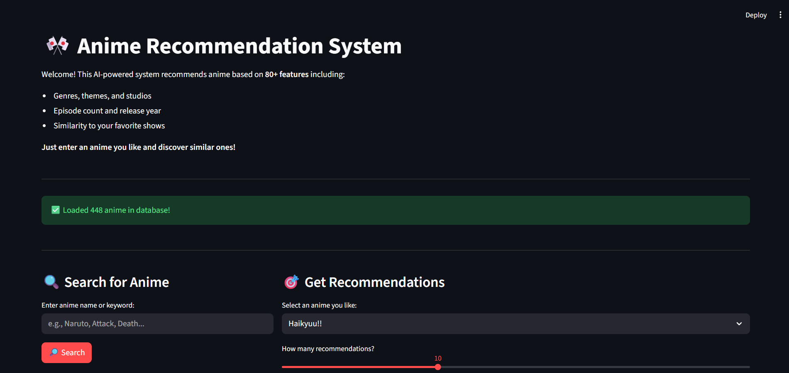
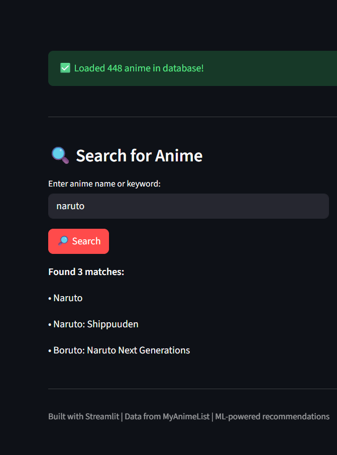
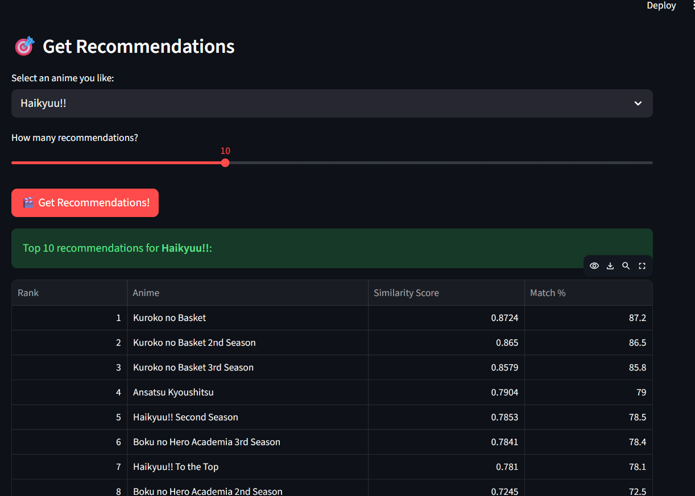
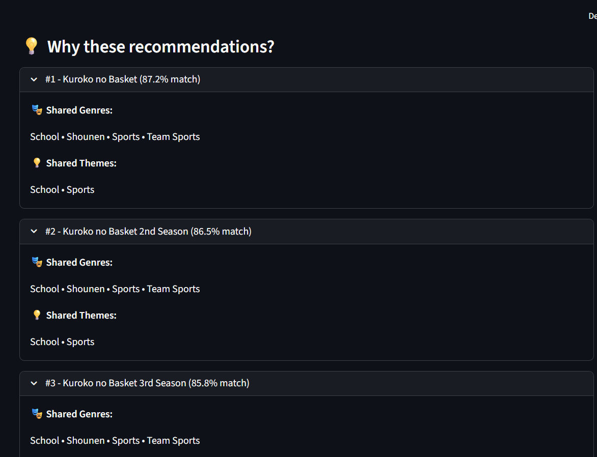

# 🎌 Anime Recommendation System

An AI-powered recommendation engine that suggests anime based on 100+ features including genres, themes, studios, and viewing patterns.

[](NONE)



---

## 🎯 What It Does

Enter an anime you like → Get 10 personalized recommendations based on similarity

The system analyzes:
- **Genres** (Action, Drama, Romance, etc.)
- **Themes** (School, Magic, War, etc.)
- **Studios** (Production companies)
- **Metadata** (Episodes, year, popularity)
- **User scores** (MyAnimeList ratings)

---

## 🚀 Quick Start

### Option 1: Try it Online
👉 [**Live Demo**](NONE)

### Option 2: Run Locally
```bash
# Clone the repo
git clone https://github.com/yourusername/anime-recommender.git
cd anime-recommender

# Install dependencies
pip install -r requirements.txt

# Run the app
streamlit run app.py
```

Open http://localhost:8501 in your browser!

---

## 📊 Dataset

- **448 anime** scraped from MyAnimeList
- **100+ features** per anime
- Data collected: October 2025
- Top anime by popularity

---

## 🛠️ Tech Stack

| Component | Technology |
|-----------|------------|
| **Web Scraping** | BeautifulSoup, Requests |
| **Data Processing** | Pandas |
| **Machine Learning** | Scikit-learn (Cosine Similarity) |
| **Web App** | Streamlit |
| **Visualization** | Matplotlib, Seaborn |

---

## 📁 Project Structure
```
anime-recommender/
├── app.py                  # Streamlit web app
├── data/
│   ├── raw/                # Scraped data
│   └── processed/          # Cleaned & engineered features
├── models/
│   └── content_recommender.pkl  # Trained model
├── notebooks/              # Jupyter notebooks (analysis)
├── src/
│   ├── scraper.py         # Web scraping logic
│   └── recommender.py     # ML functions
└── requirements.txt
```

---

## 🧠 How It Works

### 1. **Data Collection**
Scraped 448 anime from MyAnimeList including:
- Title, genres, score, popularity
- Synopsis, studios, episode count
- Release year, themes

### 2. **Feature Engineering**
Transformed raw data into ML-ready features:
- **One-hot encoding** for genres (50+ binary columns)
- **Normalization** for numerical features (0-1 scale)
- **Keyword extraction** from synopsis (school, magic, war, etc.)
- **Categorical binning** (popularity tiers, eras)

### 3. **Similarity Calculation**
Built a 448x448 similarity matrix using **cosine similarity**:
```python
similarity = cosine_similarity(features)
```
Each anime compared to every other anime based on all 100+ features.

### 4. **Recommendation**
Given an anime:
1. Find its row in similarity matrix
2. Sort all anime by similarity score
3. Return top N most similar

---

## 📈 Examples

**Input:** "Naruto"

**Output:**
| Rank | Anime | Match % |
|------|-------|---------|
| 1 | My Hero Academia | 88% |
| 2 | Black Clover | 85% |
| 3 | Demon Slayer | 82% |

**Why?** All share: Action • Adventure • Shounen • School Setting

---

## 🎓 Learning Journey

While I already had experience with web scraping, I built this project to challenge myself and focus on:
- ✅ Data cleaning & preprocessing
- ✅ Feature engineering for ML
- ✅ Designing a content-based recommendation system
- ✅ Creating an interactive Streamlit web app

**Time invested:** ~4 weeks part-time

---

## 📸 Screenshots

### Search & Recommend


### Recommendation Results


### Explanations


---

## 📝 Data Source

Data collected from [MyAnimeList](https://myanimelist.net) for educational purposes only.

This project is not affiliated with or endorsed by MyAnimeList.

---

## 👤 Author

**Alexei Luchian**
- GitHub: [@AlexeiLuchian](https://github.com/AlexeiLuchian)
- LinkedIn: [Alexei Luchian](https://linkedin.com/in/alexeiluchian)

---

## 🙏 Acknowledgments

- MyAnimeList for the data
- Streamlit for the amazing framework

---

**⭐ If you found this helpful, give it a star!**